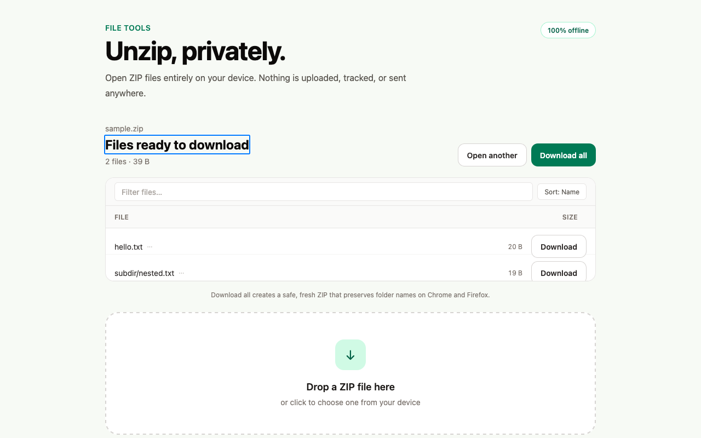
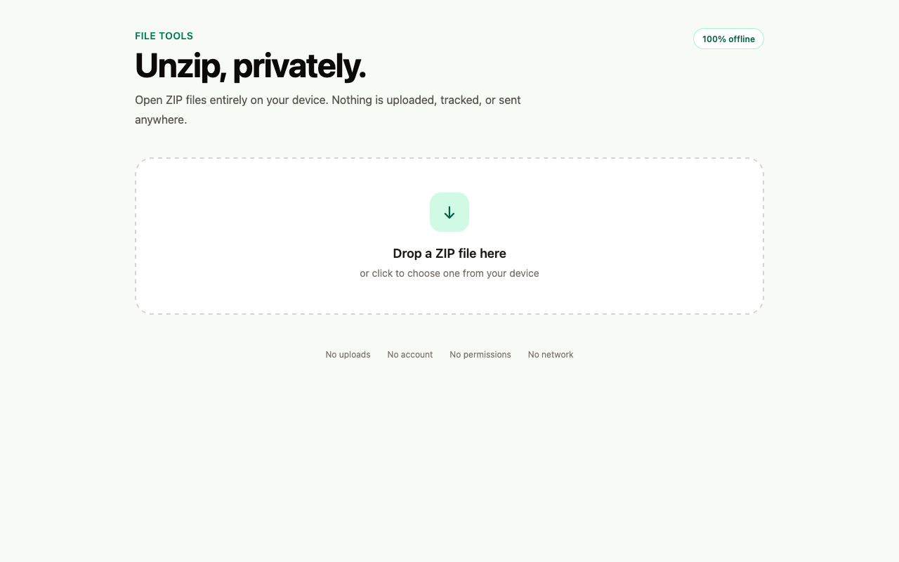
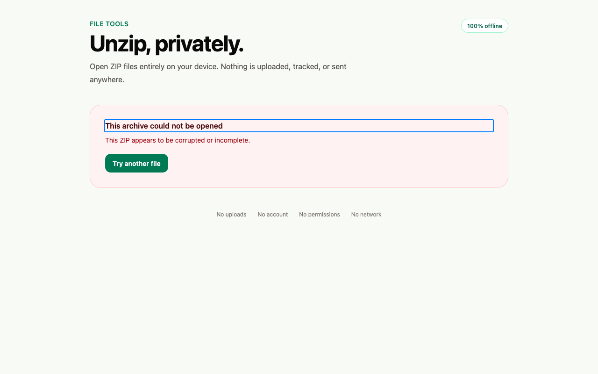

# Unzip

Private, offline ZIP extraction for Firefox and Chrome, entirely in your browser.



[](https://github.com/animeshkundu/file-tools/actions/workflows/ci.yml) [](https://github.com/animeshkundu/file-tools/actions/workflows/e2e.yml) [](LICENSE)

## The privacy promise

> **Your files never leave your device; no uploads, no accounts, no telemetry; all processing local.**

A strict no-egress content-security policy plus zero install-time permissions constrain network access; the empty permissions and no-egress content-security policy are checked in CI against the built manifest. See [docs/PEER-REVIEW.md](docs/PEER-REVIEW.md) and [docs/TEARDOWN.md](docs/TEARDOWN.md).

## Permissions and CSP

Unzip ships with an empty permission list and a strict no-egress content-security policy. Both are checked in CI against the built manifest on every change.

Declared permissions:

```json
"permissions": []
```

Extension-page content-security policy:

```
default-src 'none'; script-src 'self'; style-src 'self'; img-src 'self' data: blob:; connect-src 'none'; form-action 'none'; base-uri 'none'; object-src 'none'
```

`connect-src 'none'` blocks network connections from the extension page, `form-action 'none'` blocks form submissions, and `object-src`, `base-uri`, and `default-src` are locked to `'none'`. Saving a file uses a standard browser download from an in-page blob, so no `downloads` permission is requested. An empty permission list is not a privacy proof by itself, so the capability contract is verified through source review, the built manifests, and production-artifact tests. See [docs/PEER-REVIEW.md](docs/PEER-REVIEW.md) and [docs/TEARDOWN.md](docs/TEARDOWN.md).

## Features

- **Streaming, bounded-memory extraction** with per-entry and aggregate caps.
- **Defensive ZIP parsing** driven by the central directory and designed to fail closed. Encrypted, Zip64 and larger-than-4 GB, corrupt, crafted, and ghost archives are rejected with friendly messages.
- **Full path safety** against zip-slip, absolute, UNC, and drive paths; Windows reserved names; bidi and Unicode spoofing; and case-colliding names.
- **Fast navigation at scale** with a virtualized, sortable, filterable file tree for large archives and high entry counts.
- **Flexible downloads** for one file or the full tree, preserving structure and generating collision-safe names.
- **Safe interruption** with cancellation and a drop-outside guard that prevents accidental data loss.
- **Accessible by design**, meeting WCAG AA with a live axe gate in CI.
- **Real-Firefox end-to-end coverage** in CI, not browser emulation.
- **One MV3 codebase** for Chrome and Firefox.
- **Zero install-time permissions.**

## Screenshots

### Start with a ZIP

Drop an archive or choose one from your device.



### Inspect and download

Browse the extracted tree, filter or sort entries, then download one file or everything.


### Friendly failures

Unsafe, unsupported, or damaged archives fail closed with a clear message.



[Watch the short real-Firefox demo (MP4)](docs/media/unzip-demo.mp4) · [WebM alternate](docs/media/unzip-demo.webm)

## Install

Unzip v0.1.0 is a developer preview. Signed store listings are on the way:

- **Firefox (AMO):** coming soon
- **Chrome (Chrome Web Store):** coming soon

Until then, run it from the latest [release](https://github.com/animeshkundu/file-tools/releases) build:

- **Chrome:** unzip `file-tools-<version>-chrome.zip`, open `chrome://extensions`, enable **Developer mode**, choose **Load unpacked**, and select the extracted folder.
- **Firefox:** unzip `file-tools-<version>-firefox.zip`, open `about:debugging#/runtime/this-firefox`, choose **Load Temporary Add-on**, and select `manifest.json` from the extracted folder. A temporary add-on is cleared when Firefox restarts; a signed AMO build for persistent installation is coming soon.

## Verify your download

Download the ZIP files and `SHA256SUMS` from the [Releases page](https://github.com/animeshkundu/file-tools/releases), then verify their checksums:

```sh
sha256sum -c SHA256SUMS
```

On macOS:

```sh
shasum -a 256 -c SHA256SUMS
```

Each asset also has a keyless GitHub OIDC signature bundle. Verify the checksum file before trusting it:

```sh
cosign verify-blob --bundle SHA256SUMS.cosign.bundle --certificate-identity-regexp '^https://github\.com/animeshkundu/file-tools/\.github/workflows/release\.yml@refs/tags/v[^/]+$' --certificate-oidc-issuer https://token.actions.githubusercontent.com SHA256SUMS
```

For an independent build comparison, check out the release tag, run `npm ci`, then `npm run zip` and `npm run zip:firefox`. Compare the generated ZIP SHA-256 values with `SHA256SUMS`, or compare the build inputs with the attached sources ZIP. Byte-for-byte equality can depend on the local toolchain and packaging metadata.

## How it works

A durable extension app page owns the interface and operation lifetime, while a page-owned Web Worker keeps archive work off the UI thread. Extraction uses `fflate` within its standard-ZIP boundary, guarded by fail-closed validation and a strict no-egress CSP. Read the [vision](docs/VISION.md), [product specification](docs/PRODUCT-SPEC.md), [architecture](docs/ARCHITECTURE.md), and [design guide](docs/DESIGN.md).

## Development

Install dependencies with `npm install`, then use the scripts below:

| Task             | Chrome          | Firefox                 |
| ---------------- | --------------- | ----------------------- |
| Development      | `npm run dev`   | `npm run dev:firefox`   |
| Production build | `npm run build` | `npm run build:firefox` |

Quality and test commands:

```sh
npm run check
npm run test
npm run test:e2e
```

To load an unpacked production build:

1. Build the target browser.
2. In Chrome, open `chrome://extensions`, enable **Developer mode**, choose **Load unpacked**, and select `.output/chrome-mv3`.
3. In Firefox, open `about:debugging#/runtime/this-firefox`, choose **Load Temporary Add-on**, and select `.output/firefox-mv3/manifest.json`.

## License

Licensed under the [MIT License](LICENSE).
